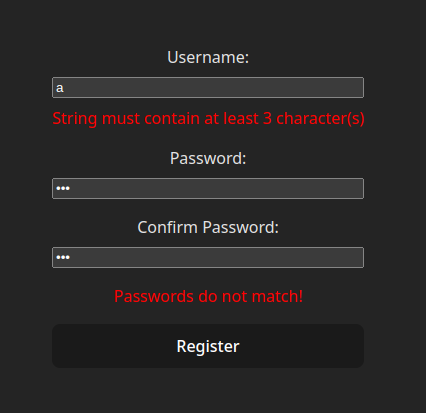

[npm]: https://img.shields.io/npm/v/@zodactive-form/react

[npm-url]: https://www.npmjs.com/package/@zodactive-form/react

[size]: https://packagephobia.now.sh/badge?p=@zodactive-form/react

[size-url]: https://packagephobia.now.sh/result?p=@zodactive-form/react

[libera]: https://img.shields.io/badge/libera-manifesto-lightgrey.svg

[libera-url]: https://liberamanifesto.com

<h1 align="center">Zodactive Form</h1>
<h2 align="center">React</h2>

Zodactive Form aims to provide a very simple form reactivity
based on the Zod validation library. This package wraps
[@zodactive-form/core](https://npmjs.com/package/@zodactive-form/core)
to work with React's reactivity.

[![npm][npm]][npm-url]
[![size][size]][size-url]
[![libera manifesto][libera]][libera-url]

## Preface

This is not an official Zod library. This is a personal project which is mainly meant
to be used by my other projects. However, you are free to use it if you find it useful.

In addition, this library is under development and not all functionality from zod is
supported yet.

## Description

This React library is a wrapper on top of
[@zodactive-form/core](https://npmjs.com/package/@zodactive-form/core) and provides
a reactive store to work forms validated with Zod.

There are 2 exported symbols in @zodactive-form/react:

- `createFormStore`: This hooks up @zodactive-form/core and creates a simple store
  which is compatible with React's `useSyncExternalStore`;
- `useForm`: This hook will automatically create a new store and return the result
  of calling `useSyncExternalStore`. The values are ready to be used in react.

## Dependencies

@zodactive-form/react has the following dependencies:

- [Zod](https://npmjs.com/package/zod): The validation library used by @zodactive-form/core;
- [React](https://npmjs.com/package/react): The reactive ui framework which this package
  wraps around;
- [@zodactive-form/core](https://npmjs.com/package/@zodactive-form/core): Contains the main
  form validation
  logic;

## Installation

As a simple npm package, it can be installed using your favorite package manager:

```shell
npm install @zodactive-form/react
```

## Usage

First, create a Zod schema. Then, pass it to `useForm()` to create a reactive store. This store
provides different functions to interact with the reactive form.

```typescript jsx
import {z} from 'zod';
import {useForm} from '@zodactive-form/react';

const userSchema = z.object({
    username: z.string().min(3),
    password: z.string().min(3),
    confirmPassword: z.string().min(3),
}).refine(
    ({password, confirmPassword}) => password === confirmPassword,
    "Passwords do not match!",
);

export const RegisterForm = () => {
    const {
        assign,
        form,
        formErrors,
        validate,
        valid,
        toJson
    } = useForm(userSchema);

    const updateField = (path: string) => (event: Event) => {
        const target = event.target as HTMLInputElement;
        assign(path, target.value);
    }

    const onSubmit = (ev: Event) => {
        ev.preventDefault();

        if (validate()) {
            const formData = toJson();
            // Form is valid and data is in the above variable!
        }
    };

    return (
        <form onSubmit={onSubmit}>
            <label>
                <span>Username:</span>
                <input type="text"
                       value={form.username.value}
                       class={form.username.error ? 'error' : ''}
                       onInput={updateField('username')}/>
                {form.username.error && <span>{form.username.error}</span>}
            </label>

            <label>
                <span>Password:</span>
                <input type="password"
                       value={form.password.value}
                       class={form.password.error ? 'error' : ''}
                       onInput={updateField('password')}/>
                {form.password.error && <span>{form.password.error}</span>}
            </label>

            <label>
                <span>Confirm Password:</span>
                <input type="password"
                       value={form.confirmPassword.value}
                       class={form.confirmPassword.error ? 'error' : ''}
                       onInput={updateField('confirmPassword')}/>
                {form.confirmPassword.error && <span>{form.confirmPassword.error}</span>}
            </label>

            {!!formErrors.length &&
                <ul>
                    {formErrors.map(err => <li>{err}</li>)}
                </ul>
            }

            <button type="submit">Register</button>
        </form>
    );
}
```



In the above piece of code, the following is happening:

- A zod schema is created, called `userSchema`;
- All fields are strings, with a minimum of 3 characters;
- A special refinement is added to make sure `password` and `confirmPassword` match;
- In the component, the store is created using `useStore`;
- To make it easy to update components, an input event helper is created: `updateField`;
- The final goal of the form is added: the `onSubmit` handler;
- The HTML contains 3 fields, each having the following properties:
    - *value* is bound to the `form.<field>.value` property of the store;
    - A *class* is dynamically set based on if `form.<field>.error` is set or not;
    - To update the store, the helper `updateField` is bound to the `onInput` event;
    - Finally, if there is an error message, a span is conditionally rendered;
- When an error does not belong to a field, it is stored in `formErrors`, so they are looped
  at the end of the form (ex: password matching error);

As you can see, it was fairly simple to create a form with full reactive validation based
on a Zod schema.

### Additional Details

- `form` contains a structure where each Zod field is split into its value and an error message.
  While `form` itself is reactive, the values inside of it are not. To update the form, make sure
  to call `assign` so the store is properly updated;
- The form is validated once when it is created, but without adding error messages. This allows the
  `valid` field to properly be set according to the provided initial data;
- When calling `validate()`, all errors are removed. If errors need to be removed at a different
  time, you can use `clearErrors()`;
